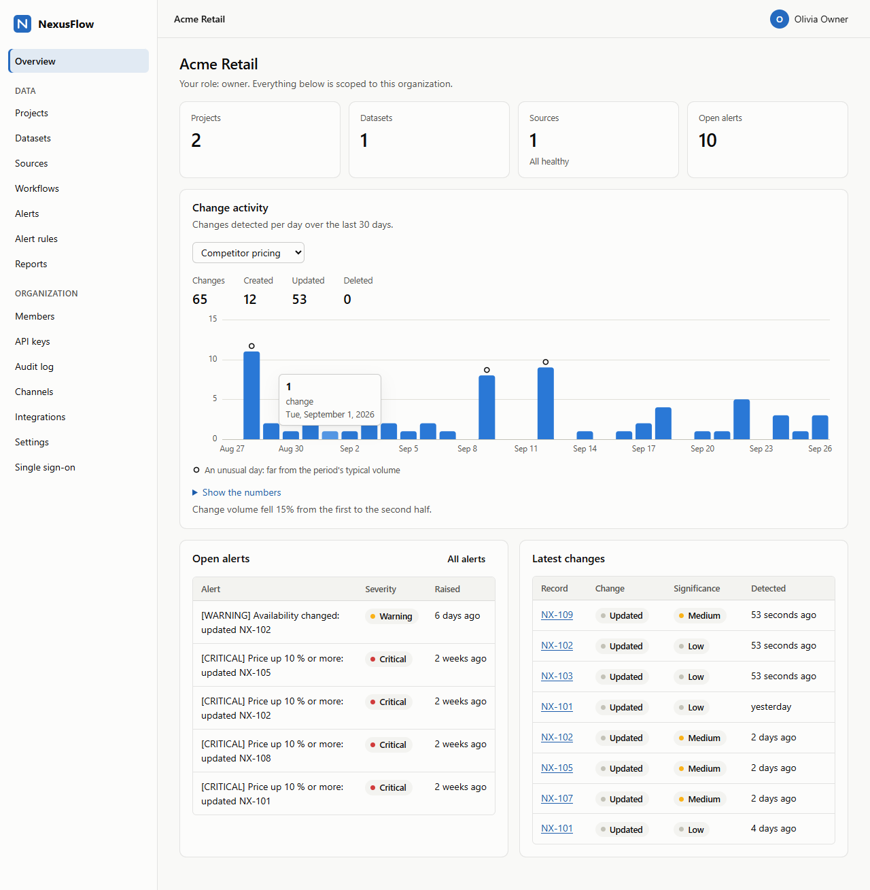
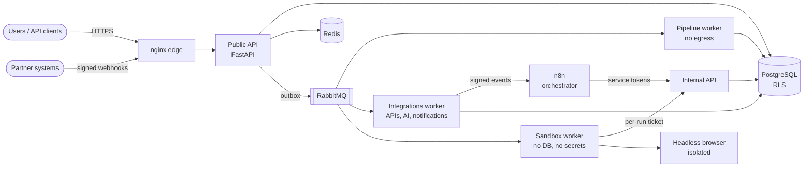

# NexusFlow AI

**An enterprise automation and competitive-intelligence platform, built with security first.**

NexusFlow AI collects business data from websites, REST APIs, signed webhooks and
CSV/XLSX uploads. It validates the data against a typed schema and keeps a full version
history. It detects meaningful changes, explains them with AI, alerts the right
people and reports trends and unusual days. Scheduling and orchestration run in **n8n**, execution in **Python**. Every step
is authorized, tenant-isolated, idempotent and audited.

```
 collect ──► validate ──► normalize ──► clean ──► dedupe ──► enrich ──► store ──► detect ──► analyze ──► alert ──► report
 (sandbox)   (schema)                                            (versions)  (diffs)    (AI, opt-in) (rules)  (JSON/CSV/XLSX/PDF)
```



*The web console with the development server's month of demo data
([CONSOLE.md](docs/CONSOLE.md); a dark theme follows the system's).*

## Why it is different

| Concern | What NexusFlow does |
|---|---|
| **Tenant isolation** | PostgreSQL row-level security (`FORCE`d) enforced on a non-`BYPASSRLS` role, plus explicit `org_id` filters in every query. Cross-tenant IDs return `404`. |
| **Authentication** | Sign-up proves the e-mail address first and answers alike for every address (no account enumeration). Argon2id passwords (breached passwords refused), 10-minute EdDSA access tokens, rotating refresh tokens with reuse detection, TOTP with replay prevention and phishing-resistant passkeys (WebAuthn) as second factors, progressive lockout, sign-in risk assessment (new device, new network, success after failures), a list of one's sessions with instant revocation, and scoped API keys hashed with a server-side pepper. Organizations can confine sessions and API keys to their own networks (IP allowlists), require passkeys of every session, and sign their members in through their own OpenID Connect provider (optionally required), with SCIM 2.0 provisioning - trusted only for the e-mail domains they proved they own. |
| **Authorization** | Five roles (owner, admin, analyst, operator, viewer) and 38 permissions, checked at the route and again in the service. |
| **Web console** | A first-party browser interface for everything above - sign-in with passkeys, TOTP or single sign-on, members, API keys, the audit log, the security policy, sources, datasets, alerts and reports - served by the edge under a strict Content-Security-Policy with Trusted Types. No framework, no build step, no third-party code; tokens held in memory. [CONSOLE.md](docs/CONSOLE.md) |
| **SSRF** | Every outbound request passes a URL policy and a connect-time IP check against every DNS answer. Redirects are re-validated, bodies are size-capped and the decompressor is bounded. |
| **Hostile content** | Web pages and uploaded files are parsed only in a **sandbox** worker that has no database, no storage and no secrets. Its only credential is a per-run HMAC ticket. |
| **AI safety** | Offline analysis by default. External AI runs only when the tenant opts in, and never for datasets classified `restricted`. PII and credentials are redacted, prompts are spotlighted, a read-only tool gateway enforces permissions and a budget, and output is strictly validated. |
| **Data classification** | Enforced, not decorative: restricted data never leaves the platform - no external AI, and alert messages carry no record keys or values. |
| **Encryption at rest** | Beyond disk encryption, the application encrypts the values of `sensitive` fields (records, history, change diffs), staged raw payloads, uploads and reports with AES-256-GCM under rotatable keys, each bound to its tenant and row or file - a stolen dump or backup reveals none of them, and a moved ciphertext fails closed. The keys can be kept wrapped by HashiCorp Vault. |
| **Encryption in transit** | TLS 1.2/1.3 at the edge, and TLS on every internal hop - PostgreSQL, both Redis instances and RabbitMQ accept nothing else - verified against the stack's private CA. |
| **Privacy (UK GDPR / GDPR)** | A person's copy of their data, erasure on request, sign-in data deleted on schedule, and audit retention that the application itself cannot shorten. [PRIVACY.md](docs/PRIVACY.md) describes what is held and for how long; a data-processing-agreement checklist helps with contracts. |
| **Audit** | Append-only SHA-256 hash chains per tenant plus a platform chain, written only through a `SECURITY DEFINER` function. `UPDATE`/`DELETE`/`TRUNCATE` are blocked by triggers; every chain is verified daily (a break pages the operators) and its head is anchored to external logs hourly. |
| **Automation control** | A service token per n8n workflow, a per-tenant freeze and a global operator kill switch. One request ID follows a request into every job it causes. |
| **Supply chain** | Hash-locked dependencies (`uv.lock`), SHA-pinned CI actions audited by zizmor, images pinned by digest, pip-audit, Bandit, Semgrep, CodeQL, Gitleaks, Trivy plus an SBOM for both images, and release images signed with cosign and attested with build provenance. Every week the platform's images are rebuilt and scanned and every third-party image is scanned; exceptions carry a reason and an expiry date. |
| **Tested as deployed** | Every CI run starts the whole stack behind its TLS edge, runs the end-to-end suite, backs the stack up, changes it, restores it and verifies the audit chains, then scans every API operation with OWASP ZAP (passive DAST; any Medium or High alert fails the build). |

## Architecture at a glance



Clean-architecture layers (`apps → bootstrap → infrastructure → domain → core`) are
enforced in CI by import-linter. The domain has no framework imports.

## Quick start

**Evaluate it in ten minutes** - the full stack behind TLS, with a scripted
walkthrough of a competitive-intelligence scenario (needs Docker, `make` and
[uv](https://docs.astral.sh/uv/); details in [docs/DEMO.md](docs/DEMO.md)):

```bash
make install
```

```bash
make secrets dev-certs
```

```bash
cp .env.example .env
```

Set `NEXUSFLOW_DOMAIN=localhost` in `.env`, then:

```bash
make demo-up
```

```bash
make demo
```

Alert e-mails arrive in Mailpit at http://127.0.0.1:8025 and the reports in
`demo-output/`. The web console is at https://localhost/: create an account there,
open the sign-up e-mail in Mailpit, and you are in.

**Develop** - the application on the host; integration tests start an embedded
PostgreSQL automatically, so no Docker is needed:

```bash
uv sync --group dev --group localdb
```

```bash
uv run pytest
```

**Try the web console without Docker** - a real API and database on your machine,
the worker tasks in-process, and a month of demo data (credentials printed):

```bash
uv run python scripts/dev_console.py
```

See [docs/DEPLOYMENT.md](docs/DEPLOYMENT.md) for production (TLS, secrets, n8n,
key rotation, backups, hardening) and [docs/DEVELOPMENT.md](docs/DEVELOPMENT.md)
for the developer workflow.

## Documentation

| Document | Contents |
|---|---|
| [ARCHITECTURE.md](docs/ARCHITECTURE.md) | Components, data flow, trust boundaries, key design decisions |
| [CONSOLE.md](docs/CONSOLE.md) | The web console: pages, security model, running it locally, tests |
| [SECURITY.md](SECURITY.md) | Security model summary and vulnerability disclosure |
| [THREAT_MODEL.md](docs/THREAT_MODEL.md) | STRIDE analysis per component, with mitigations and residual risks |
| [SECURITY_REVIEW.md](docs/SECURITY_REVIEW.md) | How the code was reviewed, every finding and its fix |
| [ASVS.md](docs/ASVS.md) | Self-assessed mapping to OWASP ASVS 5.0 (target Level 2), with evidence and gaps |
| [API.md](docs/API.md) | REST API: authentication, conventions, endpoints, errors |
| [SSO.md](docs/SSO.md) | Single sign-on (OpenID Connect) and SCIM provisioning: setup, security model, limitations |
| [CONFIGURATION.md](docs/CONFIGURATION.md) | Every setting, generated from the code |
| [DEPLOYMENT.md](docs/DEPLOYMENT.md) | Production deployment, secrets, rotation, backups, upgrades |
| [DEMO.md](docs/DEMO.md) | The ten-minute evaluation and presentation guide |
| [DEVELOPMENT.md](docs/DEVELOPMENT.md) | Local setup, testing strategy, quality gates |
| [INCIDENT_RESPONSE.md](docs/INCIDENT_RESPONSE.md) | Playbooks, kill switches, forensics |
| [PRIVACY.md](docs/PRIVACY.md) | Personal data held, retention, data-subject requests, sub-processors (UK GDPR / GDPR) |
| [DPA_TEMPLATE.md](docs/DPA_TEMPLATE.md) | Article 28 terms of a data processing agreement, with what the platform provides for each (a drafting aid) |
| [FINAL_REVIEW.md](docs/FINAL_REVIEW.md) | Architecture, security, dependency, test and deployment review; known limitations |
| [adr/](docs/adr/) | Architecture decision records |
| [workflows/n8n](workflows/n8n/README.md) | The five n8n workflows and their security model |

## Repository layout

```
src/nexusflow/
  core/            config, errors, ids, pagination, text & JSON safety, resilience
  domain/          business rules: identity, organizations, authorization, audit, catalog,
                   sources, pipeline, records, intelligence, alerts, notifications,
                   reports, automation, webhooks, uploads
  infrastructure/  PostgreSQL (SQLAlchemy 2, RLS), Redis, Celery/outbox, SSRF-safe HTTP,
                   scraping, crypto, AI provider, notifications, reporting, observability
  bootstrap/       composition roots (platform container, sandbox, HTTP stack)
  apps/            api (public + internal), workers (platform + sandbox), browser, cli
migrations/        Alembic migrations (schema, RLS policies, grants, audit functions)
workflows/n8n/     five n8n workflows + security lint (scripts/validate_n8n_workflows.py)
deploy/            nginx, PostgreSQL init, Redis ACL, RabbitMQ, Prometheus, Alertmanager, Grafana
docker/            hardened images (platform, browser) and the container health probe
scripts/           secrets and development certificates, n8n workflow generator and lint,
                   configuration reference, the demo walkthrough, backup and restore
tests/             unit, integration (real PostgreSQL), security and end-to-end tests
```

## Status and honest limitations

A complete, tested reference implementation: 2,531 tests (unit,
integration against a real PostgreSQL, security, and a walkthrough over real
HTTP) pass with 90 % line and branch coverage (each platform skips one
platform-specific test), plus 26 end-to-end tests and a
real-browser run of the web console (passkeys included) that CI runs against the
full stack, and the console's 36 Node tests; every quality gate is green - Ruff, mypy `--strict`,
import-linter, Bandit, pip-audit, zizmor, the n8n workflow lint, and the
configuration and image-digest drift checks. A self-assessed mapping to OWASP ASVS
5.0 is in [ASVS.md](docs/ASVS.md). Know the following before you deploy it:

* **Reviews were AI-assisted**, not independent: adversarial code review,
  due-diligence and traceability audits, and test-driven reviews, all carried out
  with Claude Code. Every finding and its fix is in
  [SECURITY_REVIEW.md](docs/SECURITY_REVIEW.md). No third-party penetration test
  has been done.
* **The full stack runs in CI, not yet on a customer-like host.** There is no
  Docker in the development environment. Every CI run builds and scans both images,
  starts the whole Compose stack behind the TLS edge, runs the end-to-end suite,
  backs the stack up, changes it, restores it and verifies the audit chains, and
  scans every API operation with OWASP ZAP. The first such run found three
  deployment defects that the static startup review had missed - all fixed (R11 in
  [SECURITY_REVIEW.md](docs/SECURITY_REVIEW.md)). Do a clean-host dry run before
  production.
* The n8n workflows are not run inside a real n8n by the tests: they are
  generated and linted, and CI starts n8n with the stack. The real headless
  Chromium renders a page in CI's end-to-end job, behind its pinning egress
  proxy. The platform runs fully without n8n (`internal` mode, the default).
* Single-host reference topology: no high availability.
  Single sign-on is OpenID Connect only (no SAML), not yet tried against real
  identity providers, and it needs the public API to reach them (an opt-in Compose
  overlay); its limitations are in [SSO.md](docs/SSO.md). Passkeys run end to
  end in a real Chromium in CI, but with its virtual authenticator: not yet with
  real authenticators or other browsers ([PASSKEYS.md](docs/PASSKEYS.md)).
  See [FINAL_REVIEW.md](docs/FINAL_REVIEW.md) for the full list and a roadmap.

## License

[MIT](LICENSE) © 2026 Mojtaba Karimi
