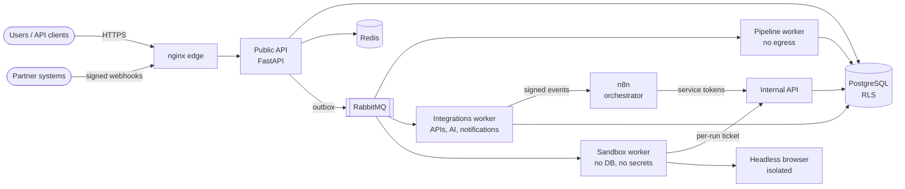

# NexusFlow AI

**An enterprise automation and competitive-intelligence platform, built with security first.**

NexusFlow AI collects business data from websites, REST APIs, signed webhooks and
CSV/XLSX uploads. It validates the data against a typed schema and keeps a full version
history. It detects meaningful changes, explains them with AI, alerts the right
people and reports trends and unusual days. Scheduling and orchestration run in **n8n**, execution in **Python**. Every step
is authorized, tenant-isolated, idempotent and audited.

```
 collect ──► validate ──► normalize ──► clean ──► dedupe ──► enrich ──► store ──► detect ──► analyze ──► alert ──► report
 (sandbox)   (schema)                                            (versions)  (diffs)    (AI, opt-in) (rules)  (JSON/CSV/XLSX/PDF)
```

## Why it is different

| Concern | What NexusFlow does |
|---|---|
| **Tenant isolation** | PostgreSQL row-level security (`FORCE`d) enforced on a non-`BYPASSRLS` role, plus explicit `org_id` filters in every query. Cross-tenant IDs return `404`. |
| **Authentication** | Argon2id passwords, 10-minute EdDSA access tokens, rotating refresh tokens with reuse detection, TOTP with replay prevention, progressive lockout, sign-in risk assessment (new device, new network, success after failures), and scoped API keys hashed with a server-side pepper. |
| **Authorization** | Five roles (owner, admin, analyst, operator, viewer) and 38 permissions, checked at the route and again in the service. |
| **SSRF** | Every outbound request passes a URL policy and a connect-time IP check against every DNS answer. Redirects are re-validated, bodies are size-capped and the decompressor is bounded. |
| **Hostile content** | Web pages and uploaded files are parsed only in a **sandbox** worker that has no database, no storage and no secrets. Its only credential is a per-run HMAC ticket. |
| **AI safety** | Offline analysis by default. External AI runs only when the tenant opts in, and never for datasets classified `restricted`. PII and credentials are redacted, prompts are spotlighted, a read-only tool gateway enforces permissions and a budget, and output is strictly validated. |
| **Data classification** | Enforced, not decorative: restricted data never leaves the platform - no external AI, and alert messages carry no record keys or values. |
| **Audit** | Append-only SHA-256 hash chains per tenant plus a platform chain, written only through a `SECURITY DEFINER` function. `UPDATE`/`DELETE`/`TRUNCATE` are blocked by triggers; every chain is verifiable and its head is anchored to external logs hourly. |
| **Automation control** | A service token per n8n workflow, a per-tenant freeze and a global operator kill switch. One request ID follows a request into every job it causes. |
| **Supply chain** | Hash-locked dependencies (`uv.lock`), SHA-pinned CI actions, images pinned by digest, pip-audit, Bandit, Semgrep, CodeQL, Gitleaks, Trivy plus an SBOM for both images, and release images signed with cosign and attested with build provenance. |

## Architecture at a glance



Clean-architecture layers (`apps → bootstrap → infrastructure → domain → core`) are
enforced in CI by import-linter. The domain has no framework imports.

## Quick start

**Evaluate it in ten minutes** - the full stack behind TLS, with a scripted
walkthrough of a competitive-intelligence scenario (needs Docker, `make` and
[uv](https://docs.astral.sh/uv/); details in [docs/DEMO.md](docs/DEMO.md)):

```bash
make install
```

```bash
make secrets dev-certs
```

```bash
cp .env.example .env
```

Set `NEXUSFLOW_DOMAIN=localhost` in `.env`, then:

```bash
make demo-up
```

```bash
make demo
```

Alert e-mails arrive in Mailpit at http://127.0.0.1:8025 and the reports in
`demo-output/`.

**Develop** - the application on the host; integration tests start an embedded
PostgreSQL automatically, so no Docker is needed:

```bash
uv sync --group dev --group localdb
```

```bash
uv run pytest
```

See [docs/DEPLOYMENT.md](docs/DEPLOYMENT.md) for production (TLS, secrets, n8n,
key rotation, backups, hardening) and [docs/DEVELOPMENT.md](docs/DEVELOPMENT.md)
for the developer workflow.

## Documentation

| Document | Contents |
|---|---|
| [ARCHITECTURE.md](docs/ARCHITECTURE.md) | Components, data flow, trust boundaries, key design decisions |
| [SECURITY.md](SECURITY.md) | Security model summary and vulnerability disclosure |
| [THREAT_MODEL.md](docs/THREAT_MODEL.md) | STRIDE analysis per component, with mitigations and residual risks |
| [SECURITY_REVIEW.md](docs/SECURITY_REVIEW.md) | How the code was reviewed, every finding and its fix |
| [API.md](docs/API.md) | REST API: authentication, conventions, endpoints, errors |
| [CONFIGURATION.md](docs/CONFIGURATION.md) | Every setting, generated from the code |
| [DEPLOYMENT.md](docs/DEPLOYMENT.md) | Production deployment, secrets, rotation, backups, upgrades |
| [DEMO.md](docs/DEMO.md) | The ten-minute evaluation and presentation guide |
| [DEVELOPMENT.md](docs/DEVELOPMENT.md) | Local setup, testing strategy, quality gates |
| [INCIDENT_RESPONSE.md](docs/INCIDENT_RESPONSE.md) | Playbooks, kill switches, forensics |
| [FINAL_REVIEW.md](docs/FINAL_REVIEW.md) | Architecture, security, dependency, test and deployment review; known limitations |
| [adr/](docs/adr/) | Architecture decision records |
| [workflows/n8n](workflows/n8n/README.md) | The five n8n workflows and their security model |

## Repository layout

```
src/nexusflow/
  core/            config, errors, ids, pagination, text & JSON safety, resilience
  domain/          business rules: identity, organizations, authorization, audit, catalog,
                   sources, pipeline, records, intelligence, alerts, notifications,
                   reports, automation, webhooks, uploads
  infrastructure/  PostgreSQL (SQLAlchemy 2, RLS), Redis, Celery/outbox, SSRF-safe HTTP,
                   scraping, crypto, AI provider, notifications, reporting, observability
  bootstrap/       composition roots (platform container, sandbox, HTTP stack)
  apps/            api (public + internal), workers (platform + sandbox), browser, cli
migrations/        Alembic migrations (schema, RLS policies, grants, audit functions)
workflows/n8n/     five n8n workflows + security lint (scripts/validate_n8n_workflows.py)
deploy/            nginx, PostgreSQL init, Redis ACL, RabbitMQ, Prometheus, Alertmanager, Grafana
docker/            hardened images (platform, browser) and the container health probe
scripts/           secrets and development certificates, n8n workflow generator and lint,
                   configuration reference, the demo walkthrough, backup and restore
tests/             unit, integration (real PostgreSQL), security and end-to-end tests
```

## Status and honest limitations

A complete, tested reference implementation: 1,440 tests (unit,
integration against a real PostgreSQL, security, and a walkthrough over real
HTTP) pass with 87 % line and branch coverage, plus 11 end-to-end tests for a
running stack; every quality gate is green - Ruff, mypy `--strict`, import-linter,
Bandit, pip-audit, the n8n workflow lint, and the configuration and image-digest
drift checks. Know the following before you deploy it:

* **Reviews were AI-assisted**, not independent: adversarial code review,
  due-diligence and traceability audits, and test-driven reviews, all carried out
  with Claude Code. Every finding and its fix is in
  [SECURITY_REVIEW.md](docs/SECURITY_REVIEW.md). No third-party penetration test
  has been done.
* **The container stack was not run in the development environment** (no Docker
  there); its startup was reviewed statically instead. CI builds and scans both
  images, runs the end-to-end suite against the full Compose stack behind the TLS
  edge and tests a backup and restore - but has not run yet (the repository is
  new). Do a clean-host dry run first.
* A real n8n and a real Chromium are not exercised by the tests. The n8n
  workflows are generated and linted; the browser's guard and pinning egress
  proxy are tested. The platform runs fully without n8n (`internal` mode, the
  default).
* Single-host reference topology: no high availability, no SSO/SCIM, no admin
  UI (API only). See [FINAL_REVIEW.md](docs/FINAL_REVIEW.md) for the full list
  and a roadmap.

## License

[MIT](LICENSE) © 2026 Mojtaba Karimi
