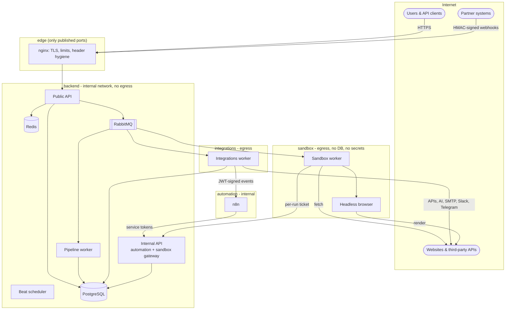
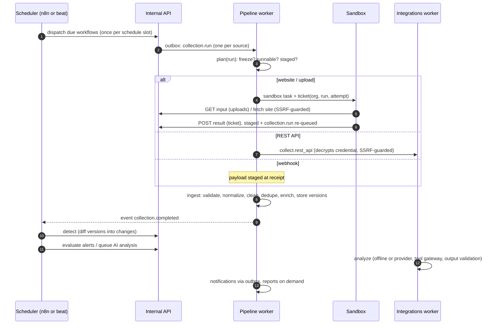

# Architecture

NexusFlow AI is a modular monolith with several runtime roles. One codebase and one
image run as a public API, an internal API, three worker pools, a scheduler and CLI
jobs. A separate image runs the headless browser. n8n orchestrates; Python executes.

## 1. Runtime components and trust zones



| Role | Command | Network access | Secrets it holds |
|---|---|---|---|
| Public API | `uvicorn ...main:create_public_app` | edge, backend | DB (app role), Redis app user, broker, JWT key, KEKs, pepper |
| Internal API | `uvicorn ...main:create_internal_app` | backend, automation, sandbox | same as the public API |
| Pipeline worker | `celery ... -Q pipeline` | backend only (**no egress**) | same |
| Integrations worker | `celery ... -Q integrations` | backend, automation, egress | same, plus the provider keys it uses |
| Beat | `celery ... beat` | backend | same |
| Sandbox worker | `celery ...sandbox:celery_app -Q sandbox` | sandbox, render, egress | broker (sandbox user: no declare rights, own queue and exchange), its own disposable `redis-sandbox`, browser token. **Nothing else.** |
| Browser | `uvicorn ...browser.app:create_browser_app` | render, egress | browser token. Chromium reaches the internet only through the service's pinning egress proxy |
| n8n | n8n | automation, n8n_data | its own DB and encryption key, service tokens in its credential store |

The internal API is never routed through the public proxy. It accepts only service
tokens (`nxs_…`, for n8n) and per-run sandbox tickets. The public API rejects both.

## 2. Code structure

```
apps  ->  bootstrap  ->  infrastructure  ->  domain  ->  core
```

* **core**: configuration (validated, fail-safe), errors, IDs (UUIDv7), keyset
  pagination, text/JSON safety helpers, resilience primitives.
* **domain**: all business rules as services over repository ports; no framework
  imports (enforced). Entities are plain dataclasses, with pydantic only for strict
  value validation.
* **infrastructure**: PostgreSQL (SQLAlchemy 2, imperative mapping), Redis, Celery,
  the SSRF-safe HTTP client, scraping, crypto, AI provider, senders, renderers,
  observability.
* **bootstrap**: composition roots. `container.py` builds the platform,
  `sandbox.py` builds the secret-less sandbox, `http.py` builds the shared outbound
  HTTP stack.
* **apps**: FastAPI apps, Celery workers, the browser service and the CLI.

`lint-imports` fails CI if a lower layer imports a higher one or the domain imports
a framework.

## 3. Multi-tenancy

* **Organization = tenant.** Users can belong to several; the access token names the
  active one (`switch-organization`).
* Every tenant table has `org_id`, **RLS enabled and forced**, and a policy comparing
  it to `nf_current_org()`. That function reads a transaction-local GUC set by
  `TenantSession` in an `after_begin` hook: every transaction, including the ones the
  ORM opens implicitly, carries the scope.
* Two roles:
  * the **migrator** owns the schema, has `BYPASSRLS` and is used only by
    `nexusflow migrate`;
  * the **app** role is `NOBYPASSRLS`, with column-level grants (for example, it
    cannot `UPDATE users.is_platform_admin`).
* Cross-tenant platform jobs (schedulers, maintenance) obtain **identifiers only**
  from `SECURITY DEFINER` functions, then open per-tenant scoped transactions.
* Repositories filter by `org_id` explicitly as well, as defence in depth.

## 4. The data pipeline



* **Stages** (`domain/pipeline/stages.py`), each a pure, separately tested function:
  | Stage | Responsibility |
  |---|---|
  | Validate | an object; every required field present; undeclared fields dropped (data minimisation) |
  | Normalize | declared types and canonical forms: numbers (currency symbols and codes, thousands and decimal separators; at most 18 fractional digits), booleans, UTC timestamps, lower-case hosts, enum spelling, NFKC text without control or invisible characters |
  | Clean | values that normalised to nothing are dropped; tracking parameters (`utm_*`, click IDs) are removed from URLs so campaign tags are not reported as changes |
  | Deduplicate | one record per key; the last occurrence wins |
  | Enrich | canonical key and content fingerprint |
* **Deduplication and versioning**: record identity is `(dataset, key_field)`, and
  a content hash decides whether a new version is written. Deletions are inferred only
  from *complete, valid, untruncated* full snapshots, and never for more than the
  source's `max_deletion_ratio` (default 50 %) of the live records in one run; above
  it the run reports `deletions_withheld` instead.
* **Change detection** diffs consecutive versions with tracked/ignored fields and
  numeric thresholds (an explicit empty allowlist tracks nothing), then scores
  significance. Relative changes are capped at +/-1,000,000 %, so extreme values
  cannot overflow and stall a dataset.
* **Alert rules** are evaluated against the complete diff, while the alert itself
  shows sensitive fields masked. `field_changed` fires on updates only (new and
  deleted records list every field). For datasets classified `restricted`, alert
  messages name the changed fields but carry no record keys or values.
* **Reports** (JSON, CSV, Excel, PDF) contain the executive summary, detected
  changes, the daily trend with a plain-language trend note, unusual days
  (robust statistics: median and MAD, so one spike cannot hide another),
  high-significance anomalies, alerts, AI insights and source references; the PDF
  and the workbook include a change-volume chart. Totals, the trend and the
  summary come from counts the database aggregates per UTC day, type and
  significance - every change of the period, however many - and the listings
  show the most significant changes. `GET /api/v1/analytics/changes` serves the
  same aggregation on request.
* **Idempotency** holds at every step:
  * run state machines (`QUEUED → RUNNING` has one winner);
  * unique constraints on changes, alerts and deliveries;
  * slot keys for scheduled workflows;
  * `Idempotency-Key` headers on API commands.

## 5. Messaging and reliability

* **Transactional outbox**: services append jobs and events to `outbox_messages` in
  the same transaction as the state change. A post-commit publisher sends them
  immediately, and a relay (`FOR UPDATE SKIP LOCKED`, leases) sends anything left
  over. Payloads carry identifiers only.
* **Celery on RabbitMQ**:
  * JSON serialization only;
  * `acks_late`, `reject_on_worker_lost`, prefetch 1;
  * quorum queues with a delivery limit and a dead-letter exchange;
  * no result backend.

  The platform exchange is a topic exchange, so delayed retries wait in RabbitMQ
  (native delayed delivery) instead of in a worker's prefetch slot. The sandbox
  queue hangs off its own direct exchange, so a compromised sandbox cannot publish
  work to other pools. Its broker user cannot declare queues or bindings, and the
  queue is bounded with `reject-publish`.
* **Retries**: transient failures back off exponentially (capped, with jitter), and
  permanent failures run compensation immediately (for example, failing the run).
  Exhausted jobs land in the **dead-letter store**. Tenant admins see a scrubbed
  message there and can retry idempotent jobs. A `job.failed` event lets n8n page
  operators.
* **Reaper** (every 5 minutes): re-queues runs stuck in `RUNNING`, with a new attempt
  that invalidates old sandbox tickets; re-queues stuck notification deliveries and
  analyses with backoff; and fails reports orphaned in `GENERATING`. Each has an
  attempt limit, after which the work is failed and dead-lettered with a
  `job.failed` event. An analysis's claim time fences out a worker whose claim
  was reaped: its late result is discarded.
* **Notification delivery**: temporary errors back off; a rate-limited channel
  defers without spending an attempt; every other failure (including a
  destination the URL policy blocks) settles the delivery, so none stays
  `SENDING`.
* **Liveness**: the worker consumer touches a heartbeat file from its event loop
  while connected to the broker, and beat on every tick; the container health
  check fails when the heartbeat is stale.

## 6. Orchestration: n8n or internal

`NEXUSFLOW_N8N__ORCHESTRATION` selects who drives the pipeline:

* **`n8n`**: n8n runs the five workflows ([workflows/n8n](../workflows/n8n/README.md))
  and calls the internal automation API. The platform forwards domain events to n8n
  webhooks with short-lived HS256 JWTs.
* **`internal`**: the event router and beat run the same steps without n8n. This is
  the fallback for development, and for incidents in which n8n itself must be cut off.

In both modes the platform always evaluates alerts for failed runs and for AI insights
itself, and every automation call honours the per-tenant freeze and the global kill
switch.

## 7. The sandbox trust boundary

Untrusted bytes (HTML, spreadsheets) are parsed only by the sandbox pool. The
dispatcher gives each run a ticket, `HMAC(pepper, "sandbox-ticket:v1:org:run:attempt")`.
With it the sandbox can:

* `GET /internal/v1/sandbox/orgs/{org}/runs/{run}/input`, the uploaded file of *that*
  run;
* `POST /internal/v1/sandbox/orgs/{org}/runs/{run}/result`, items or an error code for
  *that* run.

The ticket is checked before the result body is read, and the body is capped per run.
Results are bounded (item count, flat scalars, value length, whitelisted details),
staged and then validated again by ingestion against the dataset schema. An upload's
input can be downloaded once per attempt. A new attempt invalidates old tickets, and
closed runs reject late results. A run that ends without storing its upload marks
the upload failed, so the same file can be uploaded again. See
[ADR-0005](adr/0005-sandbox-trust-boundary.md).

## 8. AI analysis

```
changes -> strip sensitive fields -> redact PII/credentials -> bound the context
        -> spotlight (random boundary) -> model <-> tool gateway (read-only, budgeted)
        -> strict schema -> references must be real -> links only to known hosts -> insight
```

The provider is the Anthropic API behind a port, with a circuit breaker and timeouts;
an open circuit is a temporary failure, so the analysis is retried rather than lost.
The offline heuristic analyzer is the default, and the only option unless the tenant
enables `ai_external_processing` - and always for datasets classified `restricted`.
See [ADR-0006](adr/0006-ai-safety.md).

**Data classification** (`public`, `internal`, `confidential`, `restricted`) is
enforced, not decorative: restricted data never leaves the platform - no external
AI, and alert messages (which go out by e-mail, Slack, Telegram or webhook) carry
no record keys or values.

## 8a. Encryption at rest

The application encrypts what a database dump, a backup or a copy of the file
volume must not reveal, on top of any disk encryption:

| What | How | Bound to |
|---|---|---|
| Values of the fields a schema marks `sensitive` - in records, their versions and the diffs of changes (percentages included) | Sealed per value: AES-256-GCM under a fresh data key wrapped by the active KEK, stored as `{"$sealed": ..., "kid": ...}` | Tenant, dataset, record and field |
| Collected items staged between receipt and ingestion (raw source data, before any schema) | Sealed as a whole | Tenant and run |
| Stored files: uploads and generated reports | Streaming AES-256-GCM in 64 KiB chunks (STREAM construction: chunks cannot be reordered, dropped, appended or cut off) under a per-file data key wrapped by the KEK | The file's storage key |
| Integration secrets, webhook secrets, MFA secrets | Sealed (the same envelope cipher) | Their row |

Writes seal in the services that know the schema; the database layer opens sealed
values as rows load, so masking, alert rules and analysis work on plaintext exactly
as before, and a value that fails to open (a ciphertext moved to another row, a
missing key) fails closed. The stored content hash of a record is keyed (HMAC with
the pepper), so a dump cannot confirm guesses of a sensitive value either. Key
rotation re-wraps all of it (`nexusflow keys rewrap`, and the daily job); for files
only the header changes. Non-sensitive fields stay plaintext so they can be
queried: mark every personal or confidential field `sensitive`.

## 9. Observability

* **Logs**: structlog JSON with a request ID, principal and tenant context. Secret
  keys and values are redacted, and tracebacks never include local variables.
  The request ID is carried by every outbox message the request commits, and the
  worker binds it again, so the log lines of every job a request caused - however
  many hops away - share its ID (`core/correlation.py`).
* **Metrics**: Prometheus metrics for HTTP, authentication, rate limits, SSRF blocks,
  webhooks, authorization denials, tasks, dead letters, collection, changes, AI and
  notifications. Alert rules are in `deploy/prometheus/alerts.yml` and a Grafana
  dashboard is provisioned.
* **Tracing**: optional OpenTelemetry (OTLP), with FastAPI, SQLAlchemy and Celery
  instrumentation (the trace continues from the API into the workers).
* **Alerting**: Alertmanager routes the Prometheus alerts directly to operators,
  never through the platform being monitored.
* **Audit**: a hash-chained, append-only audit log per tenant, plus a platform chain
  for events without a tenant (failed sign-ins for unknown accounts, operator
  commands). Every chain is verifiable (`nexusflow audit verify`), its head is
  logged hourly for external anchoring, and a daily job verifies them all: a break
  pages the operators.

## 10. Key decisions

See the [ADR index](adr/README.md).
