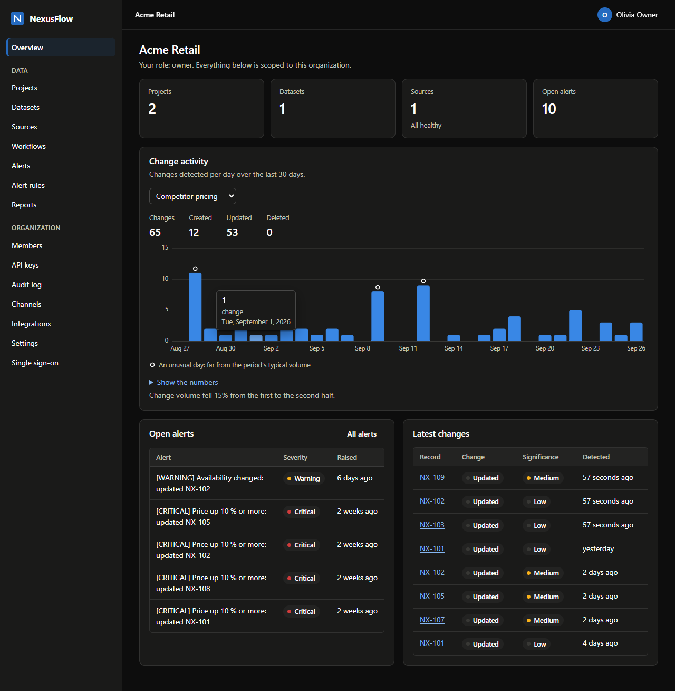
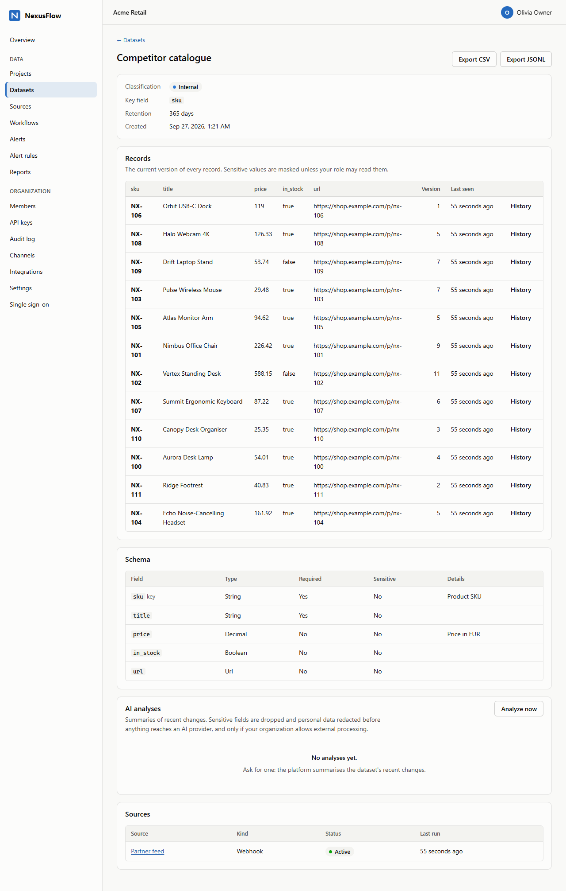
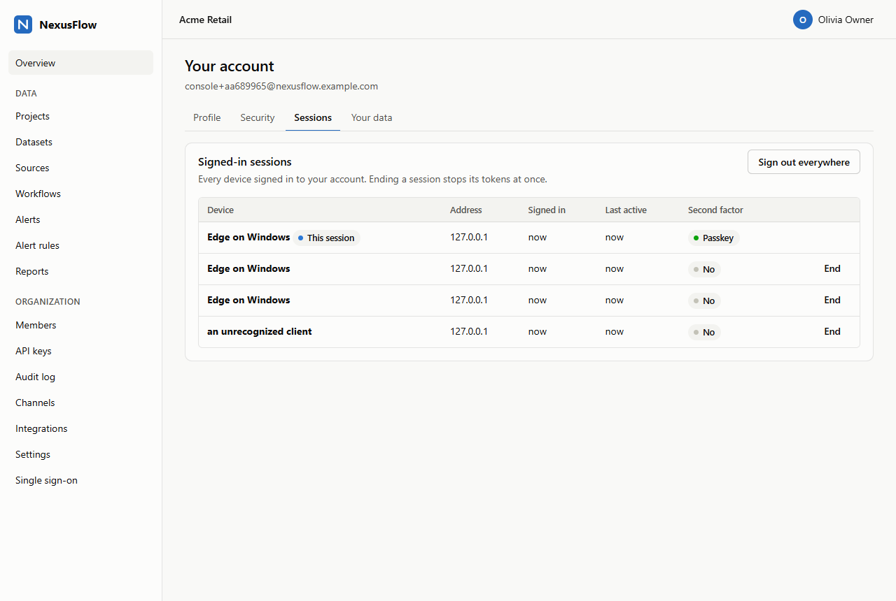

# Web console

NexusFlow's web console is the platform's first-party browser interface: signing
up and in (passwords, passkeys, authenticator apps, single sign-on), running an
organization (members, API keys, the audit log, the security policy, the
identity provider, SCIM, integrations) and working with its data (projects,
datasets and their records, sources, workflows, alert rules, alerts, reports).
Everything it does goes through the public API ([API.md](API.md)) with the
signed-in person's own session: the console holds no privileges of its own, and
every permission is checked by the API on every request.

It is also where the links the platform sends lead: `/complete-signup`,
`/reset-password` and `/accept-invitation` (e-mails) and `/sso/callback` (the
identity provider's redirect). Before the console, those links led nowhere.



## 1. How it is built and served

* **No framework, no build step, no third-party code.** Plain ES modules
  (`web/assets/js`), one stylesheet and one HTML document; nothing is fetched
  from another origin, and there is no `package.json` - no dependency tree to
  audit or to be compromised through.
* **Served by the edge.** nginx serves `web/` (mounted read-only) at `/`,
  `/assets/` and the four entry points; everything else is proxied to the API
  as before ([deploy/nginx/nginx.conf](../deploy/nginx/nginx.conf),
  [snippets/console.conf](../deploy/nginx/snippets/console.conf)). Files are
  revalidated on every load (`Cache-Control: no-cache`, `ETag`), so an update
  reaches browsers at once. They have a request budget of their own at the edge
  (`zone=console`): a first load fetches every module at once, which must not
  spend the API's.
* **Pages in the URL fragment** (`/#/datasets/…`): one document serves them all.

## 2. Security model

| Concern | How the console handles it |
|---|---|
| Cross-site scripting | Every element is built with DOM calls; strings from the API become text nodes or attribute values, never markup (`web/assets/js/dom.js`). The edge sends `Content-Security-Policy: default-src 'none'; script-src 'self'; style-src 'self'; connect-src 'self'; img-src 'self'; form-action 'none'; frame-ancestors 'none'; base-uri 'none'; require-trusted-types-for 'script'; trusted-types 'none'` - no inline script or style, no other origin, and with **Trusted Types and no policy** the browser refuses any string handed to an HTML sink (`innerHTML` and the like), even by mistake. A static test fails on any HTML sink, `eval`, string timer, inline handler or foreign resource (`tests/unit/test_console.py`) |
| Stolen tokens | The access token (10 minutes) and the refresh token live in memory only. Only if the person ticks "Stay signed in in this tab" does the **refresh** token (never the access token) go to that tab's `sessionStorage` - gone when the tab closes, removed at sign-out. Refresh tokens rotate on every use, and reusing a spent one ends the whole session |
| Cross-site request forgery | Bearer tokens only - the console never sends cookies (`credentials: "omit"`), so another site has nothing to ride on |
| Clickjacking | `frame-ancestors 'none'` and `X-Frame-Options: DENY` |
| Tokens in addresses | E-mail links carry their token in the URL fragment, which browsers never send to a server; the console reads it once and removes it from the address bar and the history before anything else (`router.js`, `takeEntry`) |
| Single sign-on | `start` returns a `state` and a client binding secret; both wait in the tab's `sessionStorage` for the provider's redirect, are single-use, and the callback's `state` must match before the code is exchanged. The provider's address must be HTTPS. See [SSO.md](SSO.md) |
| Passkeys | The browser's own WebAuthn ceremony; the console only converts the API's JSON options to the browser's form and back (`webauthn.js`) |
| Secrets shown once | API keys, SCIM tokens, webhook secrets and generated signing secrets appear once, in a dialog with a copy button and a warning; they are never stored by the console |
| What a person may see | Pages and actions follow the role's permissions (`permissions.js`, kept equal to the API's matrix by a unit test) - a convenience only: the API decides every request |
| Referrers and caches | `Referrer-Policy: no-referrer`; API responses are `no-store` |

The QR code for an authenticator app is drawn in the browser (`qr.js`, a QR
Code Model 2 encoder tested against the standard's tables and a decoder): the
TOTP secret is never sent to a QR service.

## 3. Pages

| Area | Pages |
|---|---|
| Signing in | Password sign-in with the second factor (passkey, authenticator code, recovery code), single sign-on, sign-up, password reset, invitations |
| Overview | Counts, change activity per day (a chart with a table view), open alerts, latest changes |
| Data | Projects; datasets (schema builder, records with version history, CSV/JSONL export, AI analyses); sources (configuration templates per kind, credentials, runs, uploads, webhook endpoints); workflows (run, pause, stop); alert rules; alerts; reports (generate, download) |
| Organization | Members and invitations, API keys (scopes), audit log (filters, details, chain verification), notification channels, integrations (write-only secrets), settings (security policy, network allowlist, retention, AI processing, automation kill switch, deletion), single sign-on (provider, domain proofs, SCIM tokens) |
| Account | Profile; security (password, passkeys, authenticator app, recovery codes, turning MFA off); signed-in sessions; a copy of your data; deleting the account |

A session opened through an organization's identity provider cannot manage the
account's password or second factors (the API refuses it, and the console says
so): that needs a password sign-in.



Where an organization requires passkeys, the sessions list shows which session
passed one - the only kind the organization still opens to:



## 4. Accessibility and themes

Semantic HTML (landmarks, headings, labelled controls, table headers, dialogs),
keyboard use throughout (the chart's days are reachable with the arrow keys),
visible focus, `prefers-reduced-motion`, and light and dark themes chosen for
contrast (text meets WCAG AA; status is a dot plus a word, never colour alone).
The chart follows the same rules: one colour for one series, a hairline grid,
tooltips on hover and focus, and every value in a table view.

## 5. Running it locally

Without Docker, against a real API and database on your machine:

```bash
uv sync --group dev --group localdb
uv run python scripts/dev_console.py
```

It starts an embedded PostgreSQL, migrates it with the production roles, runs
the worker tasks in-process, seeds a month of a competitor-pricing demo
(`--empty` for none), and serves the console with the edge's headers (not its
request limits: there is no nginx) at
<http://localhost:8765/>. It prints the demo owner's credentials and a sign-up
link. E-mails are kept in a local mailbox instead of sent: the links of sign-up,
password-reset and invitation e-mails are printed as they go out, and
`/_dev/mail/api/v1` answers as Mailpit's API does (search by recipient, read a
message). Trying passkeys needs an authenticator on the machine (Windows Hello,
Touch ID, a phone or a security key). Development only: it listens on 127.0.0.1
and forgets everything when it stops. With the Compose stack, the console is at
the edge's address.

The browser test (section 6) runs against it as against the stack. Playwright
comes with the `browser` extra; `NEXUSFLOW_E2E_BROWSER_CHANNEL=msedge` (or
`chrome`) drives an installed browser, otherwise run
`uv run --extra browser playwright install chromium` once:

```bash
uv run python scripts/dev_console.py --empty      # in one terminal
NEXUSFLOW_E2E_BASE_URL=http://localhost:8765 NEXUSFLOW_E2E_MAILPIT_URL=http://localhost:8765/_dev/mail CONSOLE_SCREENSHOTS=var/console   uv run --extra browser python tests/e2e/console_smoke.py
```

## 6. Tests

* `tests/web/*.test.mjs` - Node's own test runner, no dependencies: the API
  client (token refresh, errors, no cookies), routing and entry points, the
  session store, WebAuthn conversions, the QR encoder (known answers from
  ISO/IEC 18004 and a decoder that reads every symbol back) and page helpers.
* `tests/unit/test_console.py` - static checks: no HTML sinks or inline code,
  only the console's own modules, **every API call names a route and method the
  API has** (checked against its OpenAPI document), the role matrix equals the
  API's, and the entry points agree across the e-mails, the router, the edge and
  the development server. `tests/unit/test_edge_config.py` pins the console's
  headers at the edge.
* `tests/e2e/test_console.py` - through the running edge: the document, its
  policy and headers, the assets.
* `tests/e2e/console_smoke.py` - **a real Chromium** (Playwright) against the
  running stack in CI: sign up from the e-mailed link, feed a partner catalogue
  through the signed webhook, use the main pages, sign out and in; then
  **passkeys through the browser's own WebAuthn** with a virtual authenticator
  (Chromium's testing API): a password session may not require passkeys (it
  would lock itself out), a passkey is added, the next sign-in uses it, and that
  session requires them for the organization. It fails on any console error,
  uncaught exception or blocked resource, and saves screenshots (light and dark,
  and of a failure) as a CI artifact.

## 7. Limits

* English only.
* No live updates: pages show what they loaded (reports and runs have a
  refresh). Long lists page with "Load more".
* Workflows are created through the API; the console runs, pauses and stops
  them. Dead letters are handled through the API.
* Passkeys run end to end in a real Chromium, but with a virtual authenticator;
  single sign-on has been exercised only against the test suite's providers.
  Neither has been tried with real authenticators (platform or security keys),
  other browsers, or real identity providers.
