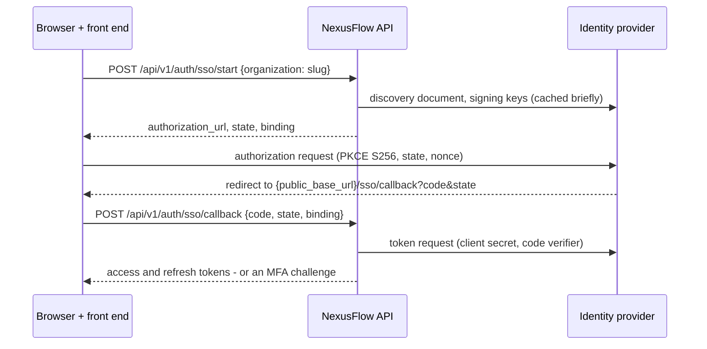

# Single sign-on (OpenID Connect) and SCIM provisioning

Each organization can let its members sign in through its own identity provider
(IdP) with **OpenID Connect**, require it, and have the IdP provision and
deprovision members with **SCIM 2.0**. This guide is for the administrators who
set it up and for reviewers who want the security model. Endpoint details are in
[API.md](API.md); settings in [CONFIGURATION.md](CONFIGURATION.md) (`NEXUSFLOW_SSO__*`).

NexusFlow is an API platform: a front end (not part of this repository) drives the
browser, and the API is the OpenID Connect **confidential client** - it holds the
client secret, redeems the code and verifies the ID token.

## 1. How a sign-in works



* **Authorization code flow with PKCE (S256)**, a random `state` and `nonce` (256
  bits each) and a fixed redirect URI, `{NEXUSFLOW_APP__PUBLIC_BASE_URL}/sso/callback`,
  never taken from the client. Scope: `openid email profile`.
* **A started sign-in** is stored server-side for 10 minutes
  (`NEXUSFLOW_SSO__STATE_TTL_SECONDS`) and used once: keyed hashes of the state, the
  binding and the nonce, and the PKCE verifier sealed with the platform's envelope
  encryption.
* **The binding.** `start` also returns a `binding` secret that never travels in a
  URL, and the callback requires it. Whoever sees the redirect (the `code` and
  `state` in a URL, a proxy log, a `Referer`) cannot finish the sign-in, and a
  victim's browser cannot be made to finish an attacker's sign-in (login CSRF).
  Keep it in memory or `sessionStorage`, and compare the returned `state` with the
  one `start` gave you before calling the callback. This is an addition to the
  plain `{code, state}` callback: see "Design notes" below.
* **The ID token** is verified strictly: its signature with a key from the
  provider's `jwks_uri` and an algorithm from an allowlist (RS256, PS256, ES256,
  EdDSA - never `none` or an HMAC algorithm, and a key only with an algorithm of its
  own type); `iss` equal to the configured issuer; `aud` containing the client id,
  and `azp` equal to it when there are several audiences (or any `azp`); `exp`,
  `iat` and `nbf` against the platform's clock with 60 seconds of tolerance
  (`NEXUSFLOW_SSO__CLOCK_SKEW_SECONDS`), and `iat` no older than 10 minutes; the
  `nonce`; `email_verified: true` (from Microsoft Entra ID, which has no such
  claim, `xms_edov: true` - section 2); from Google, an `hd` claim naming a verified
  domain (section 3). Critical header extensions are refused; `jku`, `jwk` and
  `x5u` headers are ignored.
* **Every request to the provider** goes through the SSRF-guarded HTTP client:
  HTTPS on port 443 only, every DNS answer checked at connect time (no private,
  loopback or metadata addresses), size and time limits, no redirects for the token
  request. The discovery document must name exactly the configured issuer.
* Discovery documents and key sets are cached for 5 minutes per API process
  (`NEXUSFLOW_SSO__METADATA_CACHE_SECONDS`); an unknown `kid` fetches the key set
  again, once per token.

## 2. Setting up an identity provider

Register NexusFlow at the provider as a **web application** (confidential client):

| At the provider | Value |
|---|---|
| Redirect (callback) URI | `https://<your NexusFlow host>/sso/callback` - exactly `redirect_uri` in the configuration response |
| Grant type | Authorization code (PKCE is sent; providers that support it enforce it) |
| Client authentication | Client secret: HTTP Basic (`client_secret_basic`) if the provider offers it, else in the request body (`client_secret_post`) - taken from the discovery document |
| Scopes | `openid email profile` |
| Claims in the ID token | `sub`, `email`, `email_verified` (must be `true`; from Entra ID, `xms_edov` instead), from Google `hd`, optionally `name`/`given_name`/`family_name` (the name of an account created at the first sign-in) and `amr` (see section 6) |

Then, as an owner or administrator, **from a signed-in session** (API keys are
refused):

```http
PUT /api/v1/organizations/current/sso
{
  "issuer": "https://idp.example.com/oauth2/default",
  "client_id": "0oa1b2c3d4",
  "client_secret": "…",
  "allowed_domains": ["example.com"],
  "default_role": "viewer",
  "sso_required": false,
  "trust_idp_mfa": false
}
```

* The platform fetches `{issuer}/.well-known/openid-configuration` first and
  refuses a provider that does not publish one for exactly this issuer
  (`422 sso_discovery_failed`), an issuer that is not a public HTTPS URL on port 443
  (`422 invalid_issuer`, `422 sso_issuer_not_allowed`).
* `client_secret` is write-only: required the first time, optional afterwards (the
  stored one is kept). It is sealed with AES-256-GCM, bound to the organization and
  the row, re-wrapped by key rotation, and never returned or logged.
* `default_role` is `viewer` or `analyst`: an identity provider never creates
  owners or administrators.
* Changing the issuer or client id ends every session the old provider opened and
  forgets its identity links: subjects can differ per client (Microsoft Entra ID's
  are per application), so members are linked again by their address at their next
  sign-in.
  `DELETE /api/v1/organizations/current/sso` removes the provider, ends its sessions,
  forgets its identity links and turns `sso_required` off.

Provider notes, in general terms - check your provider's current documentation:

* **Okta.** Create an OIDC *Web Application*. The issuer is your authorization
  server's: `https://<your-okta-domain>` (org authorization server) or
  `https://<your-okta-domain>/oauth2/<server-id>` (custom, e.g. `default`) - the
  exact value your discovery document shows. Okta's ID tokens carry `amr`.
* **Microsoft Entra ID.** Create an *app registration* with a **Web** redirect URI and
  a client secret. Use the tenant-specific issuer
  `https://login.microsoftonline.com/<tenant-id>/v2.0` (the multi-tenant `common` and
  `organizations` documents do not name a single issuer, so they are refused).
  Entra ID sends no `email_verified` claim: under *Token configuration*, add the
  optional ID token claims `email` and `xms_edov`. `xms_edov: true` - the address is
  in a domain your tenant verified - is what NexusFlow accepts from Entra ID in its
  place; a token with neither is refused (`403 sso_email_not_verified`). Add `amr`
  too if you turn on `trust_idp_mfa` (section 6): Entra ID's v2.0 ID tokens carry it
  only on request. Test with one account before rolling out.
* **Google Workspace.** Create an OAuth client of type *Web application* in the
  Google Cloud console (an *Internal* consent screen keeps it to your organization's
  accounts). The issuer is `https://accounts.google.com`, which serves every Google
  account: NexusFlow accepts only accounts your Workspace manages - the ID token's
  `hd` claim must name a verified domain (section 3). Google sends `email_verified`,
  but no `amr` (see section 6).

## 3. Domains and their proof

An identity provider speaks **only for e-mail addresses in domains the organization
has proved it owns.** Without that, any administrator could run a provider that
asserts someone else's address - and sign in to that person's account, or learn
whether it exists. With it, a provider holds no power the domain's owner does not
already have (they receive its mail and could reset its passwords).

* `allowed_domains` (1 to 20) lists the domains; the configuration response gives
  each one's TXT record: `_nexusflow-verification.<domain>` with the value
  `nexusflow-verification=<token>` (the token is derived from the organization and
  the domain; it is not a secret).
* Publish it, then `POST /api/v1/organizations/current/sso/domains/verify`. The
  platform looks the record up at a DNS-over-HTTPS resolver
  (`NEXUSFLOW_SSO__DNS_RESOLVER_URL`, Cloudflare's by default) and reports each
  domain as `verified`, `already_verified`, `record_not_found` or `lookup_failed`.
* Without DNS-over-HTTPS egress, or for a demonstration, an operator can confirm a
  domain checked out of band:
  `nexusflow sso verify-domain --org <id> --domain <domain> --reason <ticket>`
  (audited in the organization's trail and the platform's).
* An address matches a domain exactly: `sub.example.com` is a domain of its own.
  Removing a domain from the list removes its verification. A domain is verified
  once and not re-checked.
* Sign-in is available only while at least one domain is verified.
* **Only accounts the organization manages.** An organization's own tenant (Okta,
  Entra ID, Keycloak and the like) issues tokens for the accounts it manages. Google's
  issuer serves every Google account, so from Google the `hd` claim - the Workspace
  domain of a managed account - must name a verified domain too
  (`403 sso_account_not_managed`): a personal Google account registered with a work
  address, or kept by a former employee, has a verified address in the domain but no
  `hd`. Other public issuers that anyone can sign up to are not recognised: configure
  your organization's own tenant.

## 4. Who gets in, and which account

At the callback, after the ID token verified and its address is in a verified domain:

1. **The link first.** A person's identity at the provider (issuer + `sub`) is linked
   to their account at the first sign-in; later sign-ins find the account by it,
   even if the provider's address changed.
2. **Else the address.** An account with that address is linked - unless it is
   already linked to *another* subject at this provider (refused: a provider cannot
   take over an account by asserting its address).
3. **Else a new account** is created just in time: the address (marked verified), the
   provider's name, and **no password** - an unusable hash, as for erased accounts,
   so no password ever signs in to it. The person can set one with a password reset
   (the link goes to the address), after which the account also signs in with it.
4. **Membership.** A person who is not a member joins with `default_role`
   (audited as `auth.sso.jit_membership_created`); existing members keep their role.
   Someone the organization's directory deactivated (SCIM, or removed by an
   administrator while a directory entry exists) is refused (`403 sso_access_revoked`)
   instead of being added back.

Refusals answer as little as possible: everything about the state, the binding or
the token is `401 sso_failed` ("Single sign-on failed. Start again."). Actionable
ones have their own code: `403 sso_email_not_verified`, `403 sso_domain_not_allowed`,
`403 sso_account_not_managed`, `403 sso_access_revoked`, `403 ip_not_allowed` (the network allowlist, checked before
anything is created), `403 mfa_required`, `403 passkey_required`, `403 org_inactive`, `503 sso_unavailable`.
Every refusal of a well-formed callback is audited with a reason (`auth.sso.failed`),
in the organization's trail - or the platform's when the state is unknown.

The platform's account lockout does not block a single sign-on, and a provider's
sign-in does not reset it: the lockout guards the password and the account's second
factor (one counter for both, until a sign-in completes with them), and a provider's
sign-in proves neither. The platform's own second factor after a single sign-on
(section 6) is different: a wrong code or a refused passkey counts toward the
lockout, a locked account cannot complete it, and completing it resets the counter,
as a completed password sign-in does. New-device and
suspicious sign-in notices work as for a password sign-in (not for an account the
sign-in just created).

## 5. Sessions an identity provider opens

A session opened by single sign-on is **bound to that organization**:

* its tokens name that organization only; `switch-organization` to another one is
  refused (`403 sso_session_bound`) - sign in again (with a password, or another
  organization's provider) for another organization;
* its account-wide actions are confined to that organization: the session list and
  ending sessions show and reach only the sessions that provider opened, "log out
  everywhere" ends only those, and the organization list shows only that
  organization;
* the account itself - which every organization of the person relies on - is out of
  its reach, even with the password: the personal-data export, changing the
  password, listing or changing second factors (TOTP, passkeys, turning MFA off) and
  deleting the account are refused (`403 sso_session_restricted`) - sign in with the
  password (and the account's second factor) for them. The provider's MFA, or the
  platform's second factor after it, counts for that organization only; otherwise
  whoever runs one organization's provider and knows a member's password could plant
  a second factor of their own on the account;
* it stops working when the member leaves the organization (every request checks
  the membership, and the next refresh revokes the session - if the member is added
  back before that refresh, it works again, as a password session would); it ends
  when the organization removes or replaces its provider; and it is subject to every
  per-request check the platform already makes (session, membership, role,
  organization status, network).

So one tenant's identity provider never opens another tenant's data, whatever it
asserts - even for a person who belongs to both.

Signing out at the identity provider does not end NexusFlow sessions (no
front-channel or back-channel logout): end them with `POST /auth/logout`, by
deprovisioning the person (SCIM), or by removing the member.

## 6. MFA

An organization that requires MFA (`require_mfa`) accepts a single sign-on as MFA
**only when `trust_idp_mfa` is on and the ID token's `amr` claim contains at least
one of `mfa`, `mca`, `hwk`, `swk`, `otp`, `sc`** (RFC 8176: multiple factors or
channels, proof of possession of a hardware or software key, a one-time password, a
smart card). `pwd`, `kba`, `pin` and biometric values alone do not count; a token
without `amr` does not count. `trust_idp_mfa` is off by default.

Otherwise, when the organization requires MFA:

* a person with the platform's own second factor - TOTP or a passkey - is asked for
  it after the provider: the callback answers `{mfa_required, mfa_token, expires_in,
  methods}` (`methods` names `totp`, `webauthn` and `recovery_code` as they apply),
  finished with `POST /auth/mfa/verify` (a TOTP or recovery code) or with a passkey
  (`POST /auth/mfa/webauthn/begin`, then `/verify`). Either way the session is bound
  to the organization, as above, and `auth.sso.succeeded` names the factor
  (`mfa_method`);
* a person without it is refused (`403 mfa_required`). Accounts created by single
  sign-on have no password and so can set up neither TOTP nor a passkey (both need
  the password, from a password sign-in - section 5): an organization that requires
  MFA and uses single sign-on should trust its provider's MFA (and enforce MFA
  there). Google does not send `amr`, so with Google the platform's second factor is
  the only way.

When the organization does not require MFA, a single sign-on does not ask for the
platform's second factor even if the person set one up: the provider authenticates
them, and the session reaches that organization only (section 5).

**An organization that requires passkeys** (`require_passkey`,
[PASSKEYS.md](PASSKEYS.md), section 4) never counts the provider's MFA, whatever
`trust_idp_mfa` and `amr` say:

* after the provider, the callback always answers `{mfa_required, mfa_token,
  expires_in, methods: ["webauthn"]}`, and only a passkey
  (`POST /auth/mfa/webauthn/begin`, then `/verify`) completes it, into a session
  bound to the organization that counts as a passkey sign-in;
* a TOTP or recovery code sent to `/auth/mfa/verify` is checked, used up and refused
  (`403 passkey_required`, audited as `auth.sso.failed` with reason
  `passkey_required`, `step: mfa` and the factor);
* a person without a passkey is refused at the callback (`403 passkey_required`),
  before anything is created. Accounts created by single sign-on have no password and
  so cannot register one (section 5): in such an organization, only people whose
  account has a password and a passkey registered from a password sign-in get in
  through the provider;
* sessions opened before the policy - also those the provider's MFA verified - are
  refused until their people sign in again with a passkey.

## 7. Requiring single sign-on

With `sso_required: true`, members reach the organization **only with a session its
provider opened**: a password session is refused (`403 sso_required`), switching into
the organization is refused, and signing in with a password *naming* the
organization is refused - and shown in its trail (`auth.login.failed`, reason
`sso_required`). A password sign-in that merely defaults to it opens the account
without it.

* **Break-glass for owners:** an owner whose session passed the platform's own MFA
  (the password, then TOTP, a passkey or a recovery code) still gets in - the way
  back when the provider is down or misconfigured. Nobody else does (administrators
  included). Owners who might need it set up TOTP or a passkey beforehand from a
  password sign-in: the MFA enrolment and passkey registration endpoints accept such
  a session even where single sign-on is required. Where the organization also
  requires passkeys, the break-glass sign-in must use one.
* It needs a verified domain, and is refused when it would lock the caller out
  (`422 would_lock_you_out`): turn it on from a session the provider opened, or as an
  owner with MFA. It is set only through this configuration, never through
  `PATCH /organizations/current`.
* **API keys and SCIM tokens are not affected**: they are machine credentials,
  confined by their scopes, their organization and its network allowlist. Revoke
  the keys you do not want.

## 8. SCIM 2.0 provisioning

An owner creates a SCIM token from a signed-in session:

```http
POST /api/v1/organizations/current/scim-tokens {"name": "Okta", "expires_in_days": 365}
```

The `nxp_…` token is shown **once** and stored only as a keyed hash; at most 10 live
tokens per organization; `DELETE …/scim-tokens/{id}` revokes one. Configure the
identity provider's SCIM client with:

| Setting | Value |
|---|---|
| Base URL | `https://<your NexusFlow host>/scim/v2` |
| Authentication | HTTP header `Authorization: Bearer nxp_…` (OAuth bearer token) |
| User identifier (`userName`) | The person's e-mail address |
| Supported | `GET /ServiceProviderConfig`, `/ResourceTypes`, `/Schemas`; `GET/POST /Users`; `GET/PUT/PATCH/DELETE /Users/{id}` |

How it behaves:

* **Create** (`POST /Users`): `userName` must be an address in a **verified domain**
  (section 3), which needs single sign-on configured. An account with the address
  is linked; otherwise one is created without a password, as in section 4. An
  active entry makes the person a member with `default_role`; a member keeps their
  role. `201` with the resource and a `Location` header; a second entry for the same
  person or `externalId` is `409 uniqueness`.
* **Filters**: `userName eq "…"` (any case), `externalId eq "…"` (exact) and
  `emails.value eq "…"`; anything else is `400 invalidFilter`. Paging with
  `startIndex` (from 1) and `count` (at most 200); results oldest first.
* **Replace and patch**: `PUT` replaces the entry (attributes left out are cleared);
  `PATCH` supports `add` and `replace` of `active`, `externalId`, `displayName`,
  `name` (and `name.givenName`, `name.familyName`, `name.formatted`) and `emails`,
  with or without a `path` (Okta sends a value object, Microsoft Entra ID paths such
  as `emails[type eq "work"].value` and booleans as the strings `"True"`/`"False"` -
  both work). `remove` is not supported.
* **Deprovisioning**: `active: false` - or `DELETE /Users/{id}` - removes the
  membership and revokes the member's API keys in the organization, exactly like
  removing a member; the member's sessions lose the organization at once (every
  request checks the membership), so a session its provider opened can reach
  nothing more - and its next refresh revokes it. The account
  itself is **never deleted** (it may belong to other organizations). `active: true`
  makes the person a member again, with `default_role`. `DELETE` also removes the
  entry (`GET` answers `404` afterwards).
* **Owners are never touched**: deactivating or deleting an owner's entry is refused
  (`403`), and audited. Administrators can be deprovisioned.
* **Never taken from SCIM**: passwords (refused), roles, groups and entitlements
  (ignored - SCIM grants no role but `default_role`), `id` and `meta` (ignored),
  attributes of extension schemas and core attributes this service does not keep,
  such as `title` or `phoneNumbers` (ignored); a PATCH path that names no User
  attribute is `400 invalidPath`. `userName` cannot be changed
  (`400 mutability`): the address is the account's sign-in identifier, shared by all
  its organizations - deprovision and provision the new address.
* Names sent by SCIM are kept on the directory entry; the account's own name (shown
  in every organization) is set only when SCIM creates the account.
* A member an administrator removes in the application shows as `active: false`, and
  single sign-on does not add them back; the provider re-activates them on purpose.
* Requests are rate-limited per token (600 a minute, fail closed), bodies are capped
  at 64 KiB, and the organization's network allowlist applies (add your provider's
  provisioning addresses to it). Errors use the SCIM Error schema
  (`urn:ietf:params:scim:api:messages:2.0:Error`). A SCIM token is refused by every
  other endpoint, and no other credential works on `/scim/v2`.

Provider notes: in **Okta**, add SCIM provisioning to the application (SCIM 2.0,
header authentication, `userName` = e-mail, push new users, profile updates and
deactivation). In **Microsoft Entra ID**, set the *Tenant URL* to the base URL and
the *Secret Token* to the SCIM token, and map `userPrincipalName` or `mail` to
`userName` - it must be the person's address in a verified domain.

## 9. Security model

| Threat | Control |
|---|---|
| A tenant's identity provider asserting another person's address | Addresses accepted only in domains the organization proved (DNS TXT or operator); from Google, only accounts the organization's Workspace manages (`hd`); a linked account never re-linked to another subject; sessions bound to the organization |
| Account enumeration through JIT or SCIM | Only verified-domain addresses are ever looked up; `start` answers alike for unknown organizations, organizations without single sign-on and those with no verified domain; password-less accounts cost a full password verification at sign-in |
| Stolen code or state (logs, `Referer`), login CSRF, code injection | Client binding secret, PKCE S256, single-use state (10 minutes), fixed redirect URI |
| ID token forgery or confusion | Algorithm allowlist, key type bound to the algorithm, JWKS from the discovery document only, `iss`/`aud`/`azp`/times/`nonce` checked, a verified address required (`email_verified`; from Entra ID, `xms_edov`) |
| SSRF through a tenant-configured issuer | SSRF-guarded client, HTTPS on 443 only, connect-time IP checks of every DNS answer, discovery must name the issuer exactly, no redirects for the token request |
| Leaked client secret | Sealed at rest (AES-256-GCM, bound to the row), write-only in the API, never logged, re-wrapped by key rotation |
| Leaked SCIM token | Keyed hash only, expiry (at most a year), revocation, one organization, SCIM endpoints only, rate limit, network allowlist, no owner changes, verified domains only, every change audited |
| Privilege escalation through the provider | JIT and SCIM grant `viewer` or `analyst` only; roles and groups from SCIM ignored; existing members keep their role |
| Bypassing `sso_required` | Enforced on every request, at sign-in naming the organization and at switching; owners' break-glass needs the platform's MFA |
| A provider's session (with a known password) reaching the account itself | A bound session cannot export the account's data, change its password or second factors, or delete it - the provider's MFA never stands in for the account's own second factor |
| A provider's weaker MFA where the organization requires passkeys | The provider's MFA never counts there; only the platform's passkey step completes the sign-in |

Audit events: `sso.configured`, `sso.updated`, `sso.removed`, `sso.domain_verified`,
`auth.sso.succeeded` (with `mfa`, `idp_mfa`, and `mfa_method` when the platform's
second factor was used), `auth.sso.failed` (with a reason), `auth.sso.identity_linked`,
`auth.sso.jit_user_created`, `auth.sso.jit_membership_created`,
`scim.token_created`, `scim.token_revoked`, `scim.user_created`, `scim.user_updated`,
`scim.user_deactivated`, `scim.user_reactivated`, `scim.user_deleted`,
`scim.request_refused`, and `member.joined` / `member.removed` with `via: scim`. SCIM
tokens appear as actor type `scim`.

## 10. Deployment

The public API finishes sign-ins by calling identity providers, and checks domain
records at the DNS-over-HTTPS resolver. The base Compose stack gives the API no
internet access, so single sign-on needs the overlay
`docker compose -f docker-compose.yml -f docker-compose.sso.yml up -d` (with the demo
overlay, add `-f docker-compose.sso.yml` after it), which adds the API to the `egress`
network; apply the egress firewall of
[DEPLOYMENT.md](DEPLOYMENT.md) (section 1) to it too. The trade-off: a compromised
public API process could open outbound connections (the application's own requests
are SSRF-guarded; a compromised process no longer runs those guards). SCIM needs no
outbound access.

## 11. Limitations

* One OpenID Connect provider per organization; no SAML, no IdP-initiated sign-in,
  no `userinfo` call (the ID token's claims are used).
* No front- or back-channel logout: signing out at the provider does not end
  NexusFlow sessions.
* No group or role mapping: SCIM and just-in-time sign-in grant `default_role`;
  roles are managed in the application.
* Just-in-time account creation cannot be turned off separately from single sign-on.
  After SCIM *deletes* an entry (rather than deactivating it), a later sign-in through
  the provider would add the person again - the provider decides who can sign in.
* Guests whose address is outside the organization's verified domains cannot use
  single sign-on (and cannot reach an organization that requires it).
* Domains are verified once, not re-checked; the verification trusts the DNS answer
  of the configured DNS-over-HTTPS resolver.
* `userName` (the address) cannot be changed through SCIM, and SCIM names do not
  update the account's profile. A single sign-on session can still change the
  account's display name (`PATCH /users/me`), which every organization of the person
  shows.
* Discovery documents and keys are cached per API process, so a provider's key
  rotation is seen within `NEXUSFLOW_SSO__METADATA_CACHE_SECONDS` (or at the first
  token signed with the new key).
* The public API needs outbound HTTPS (section 10).
* Public issuers that anyone can sign up to are not detected (Google's is: its `hd`
  claim is checked); use your organization's own tenant.
* Not yet tried against the real providers: the tests run every flow against an
  in-process provider that follows the specifications (discovery, signing keys, the
  token endpoint, ID tokens). Sign in with one account before rolling out.

## 12. Design notes

* **Verified domains** go beyond "allowed e-mail domains": an unverified list would
  let an administrator of any organization take over, or probe, accounts in any
  domain through an identity provider they control.
* **The client binding** (`binding`) is an addition to a `{code, state}` callback, so
  that the redirect URL alone is not enough to finish a sign-in.
* **Organization-bound sessions** keep a provider's assertion within the
  organization that configured it - including its MFA assertion, which says nothing
  to other organizations' policies.
